# Przeszukiwanie i optymalizacja - Dokumentacja końcowa

**Skład zespołu:** Rafał Celiński, Mateusz Łukasiewicz

## **1. Streszczenie założeń**

### **Problem**

#### Rozmieszczenie towarów w magazynie 2D za pomocą algorytmu ewolucyjnego

Celem projektu jest opracowanie algorytmu ewolucyjnego do rozmieszczenia towarów w magazynie o określonym kształcie. Zadaniem algorytmu jest maksymalizacja powierzchni zajętej przez towary przy jednoczesnym spełnieniu warunków:

- Między towarami istnieje przestrzeń dla swobodnego przemieszczania się magazyniera.
- Unikamy nakładania się towarów.
- Zapełniamy tylko obszar magazynu.

### **Reprezentacja magazynu i chromosomu**

Nastąpiły drobne zmiany w porównaniu do definicji z projektu początkowego. Powodem ich wprowadzenia było ułatwienie implementacji i możliwe zmniejszenie skomplikowania:

#### **Towary**

##### **Wcześniej**

Każdy towar ma kształt prostokąta i jest definiowany przez wymiary: długość oraz szerokość. Przed uruchomieniem algorytmu użytkownik wgrywa listę towarów z ich wymiarami, np. `[(2, 3), (1, 2), ...]`, gdzie pierwsza wartość to `długość`, a druga to `szerokość`.  

##### **Teraz**

Każdy towar ma kształt prostokąta i jest definiowany przez atrybuty: id, długość, szerokość, x, y, orientacja, obecność.

Gdzie `x`, `y` to współrzędne punktu zaczepienia towaru, `orientacja` to orientacja (`pion` lub `poziom`), a `obecność` to wskazanie, czy dany towar będzie znajdował się w magazynie (`true` lub `false`).  

#### Magazyn

Magazyn jest reprezentowany jako macierz prostokątna, gdzie:

- ` ` – wolne pole,
- `-1` – pole poza magazynem,
- `1, 2, ..., n` – identyfikatory towarów.  

W przypadku, gdy towary będą na siebie nachodziły, trzymamy kilka identyfikatorów na jednym polu.  

Wprowadzona zmiana: Każde pole w magazynie dodatkowo przechowuje status: `EMPTY`, `WALL`, `WALL_COLLISION`, `WARE`, `COLLISION`.  

Zwiększa to przejrzystość w wyświetlaniu magazynu i zmniejsza trochę ilość logiki związanej ze sprawdzaniem pól.  

#### Chromosom

##### **Wcześniej**

Lista pozycji towarów, np. `[(x1, y1, orientacja1, obecność1), (x2, y2, orientacja2, obecność2), ...]`, gdzie `x`, `y` to współrzędne punktu zaczepienia towaru, `orientacja` to orientacja (`pion` lub `poziom`), a `obecność` to wskazanie, czy dany towar będzie znajdował się w magazynie (`true` lub `false`).  

##### **Teraz**

Lista towarów razem z macierzą magazynu odpowiadającą rozmieszczeniu tych towarów. Towary teraz posiadają wszystkie powyższe atrybuty jako jeden obiekt – w poprzednich założeniach niepotrzebnie było to rozdzielane, co tylko komplikowało implementację.

## **2. Opis funkcjonalny**

### **Implementacja**

Problem został zrealizowany przy pomocy kilku klas dzielących funkcjonalności:

- **`Enums`** - Enumeratory używane do:
  - Określania orientacji towaru,
  - Statusu konkretnych pól w magazynie,
  - Typu mutacji na danym chromosomie (dokładniejsze wyjaśnienie w dalszej części dokumentu).
  
- **`Ware`** - Klasa towaru znajdującego się w magazynie. Z tej klasy jest skomponowany chromosom. Towar jest tworzony poprzez losowe umieszczenie go w magazynie.  

- **`Magazine`** - Klasa magazynu, przechowuje macierz pustego magazynu jako bazę do obliczeń. Jest odpowiedzialna za:
  - **Generowanie towaru**: Po otrzymaniu wymiarów tworzy obiekt klasy `Ware` umieszczony losowo w magazynie (bez kontroli nad pozycją towaru – jedynym wymogiem jest, by punkt zaczepienia towaru był w macierzy).  
  - **Generowanie zapełnionego magazynu** na podstawie dostarczonej listy `Ware`. W ten sposób otrzymujemy macierz gotową do wyświetlenia oraz statystyki potrzebne do obliczenia funkcji celu, takie jak `filled_space`, `collisions`, `wall_collisions`, `something_nearby`.  
  - **Zapisywanie macierzy do pliku**, umożliwiając wizualne ocenienie jakości wyniku.

- **`Chromosome`** - Klasa zawierająca listę towarów oraz macierz zawierającą ich rozmieszczenie. Zawiera metody implementujące:
  - **Mutację**: Polega na modyfikacji jednego atrybutu `Ware` z listy. Wybór atrybutu opiera się na losowaniu go na podstawie parametrów prawdopodobieństwa ustalonych na etapie testowania.
  - **Krzyżowanie jednopunktowe**: Losowany jest jeden punkt przecięcia. Tworzymy dwóch potomków zawierających po jednej pociętej części rodziców. Zwracamy losowego potomka.  
  - **Krzyżowanie dwupunktowe**: Analogiczne do jednopunktowego, ale punkty przecięcia są dwa.

- **`EvolutionAlgorithm`** - Główna klasa odpowiedzialna za optymalizację rozmieszczenia towarów w magazynie. Jej zadania to:
  - **Ewaluacja chromosomu**: Wzór to `f(C) = w1 * filled_space - w2 * wall_collisions - w3 * collisions - w4 * something_nearby`.  
  - **Mutowanie chromosomu**: Wywołuje mutację na każdym chromosomie z pewnym prawdopodobieństwem.  
  - **Selekcja**: Przeprowadza selekcję turniejową lub ruletkową.  
  - **Reprodukcja**: Przeprowadza operacje krzyżowania jedno lub dwupunktowego.  

### **Inicjacja algorytmu**

Przed rozpoczęciem działania `EvolutionAlgorithm` potrzebuje zestawu parametrów definiujących go. Te parametry to:

- Wierzchołki magazynu – punkty w układzie kartezjańskim definiujące kształt magazynu (tworzenie macierzy realizujemy przy pomocy biblioteki `Shapely`).
- Lista wymiarów towarów.
- Wybrany rodzaj krzyżowania i selekcji.
- Liczba elitarnych osobników.
- Prawdopodobieństwo mutacji.
- Prawdopodobieństwa wyboru atrybutu mutowanego.
- Prawdopodobieństwo krzyżowania.
- Parametry funkcji celu `w1, w2, w3, w4`.
- Rozmiar populacji.
- Liczba epizodów.
- Nazwa – potrzebna do generowania plików, by łatwo identyfikować rezultaty.  

## **3. Zbiory danych i sposób testowania**

Do testowania i ustalania parametrów użyliśmy jednego zestawu wierzchołków i listy wymiarów towarów. Kształt magazynu nie był prostym kwadratem, a towary zapewniały różnorodność i dużą liczbę możliwych ustawień:  

```python
vertices = [(0, 0), (0, 3), (5, 5), (5, 7), (0, 7), (0, 10), (12, 12), (12, 0)]
wares_data = [
    (1, 1), (1, 1), (1, 1), (1, 1), (1, 1),
    (1, 2), (1, 2), (1, 2), (1, 2), (1, 2),
    (2, 2), (2, 2), (2, 2), (2, 2), (2, 2),
    (2, 3), (4, 3), (3, 3), (3, 3), (3, 3), (3, 3)
]
```

Dodatkowo przetestowaliśmy algorytm na większych zestawach danych:

```python
vertices1 = [(0, 0), (0, 3), (5, 5), (5, 7), (0, 7), (0, 10), (12, 12), (12, 0)]
vertices2 = [(0, 0), (0, 10), (10, 10), (10, 0)]
vertices3 = [(2, 0), (2, 2), (0, 2), (0, 5), (2, 5), (2, 8), (5, 8), (5, 5), (8, 5), (8, 2), (5, 2), (5, 0)]

wares_data1 = [(1, 1), (1, 1), (1, 1), (1, 1), (1, 1),
              (1, 2), (1, 2), (1, 2), (1, 2), (1, 2),
              (2, 2), (2, 2), (2, 2), (2, 2), (2, 2),
              (2, 3), (4, 3), (3, 3), (3, 3), (3, 3), (3, 3)]

wares_data2 = [(1, 1), (1, 1), (1, 1), (1, 1), (1, 1),
              (1, 2), (1, 2), (1, 2), (1, 2), (1, 2),
              (2, 2), (2, 2), (2, 2), (2, 2), (2, 2),
              (1, 2), (1, 2), (1, 2), (1, 2), (1, 2),
              (2, 3), (2, 3)
              ]
```

Do generacji wykresów używaliśmy wyników uśrednionych. Każdy algorytm testowany był na pięciu próbach.  

## **4. Problemy z przestrzenią danych i potencjalne rozwiązania**

Z racji tego, że przestrzeń dla wykorzystywanych danych jest bardzo duża, dla przykładowego zestawu była równa:  
`(13^2 (liczba pozycji zaczepienia towarów) * 2 (orientacja pozioma/pionowa) * 2 (jest w magazynie/nie))^21 (liczba możliwych towarów)`  
co daje około `2,68 * 10^59`. (Gdyby podnieść tą liczbę do kwadratu dostalibyśmy wartość większą niż estymowana liczba atomów we wszechświecie)

Zdecydowaną większość można by uznać za rozwiązania zupełnie niepoprawne. Pełne pokrycie takiej przestrzeni i uzyskanie optimum globalnego jest praktycznie niemożliwe, dlatego do podstawowego algorytmu ewolucyjnego wprowadziliśmy kilka modyfikacji.

### **Inicjalizacja dużą populacją**

Rozsądnym wydaje nam się, aby na samym początku stworzyć bardzo dużą populację (np. 250 tyś. chromosomów) i z tej populacji wybrać najlepsze osobniki, które stanowiłby już właściwą populację.  

Takie podejście daje w teorii lepsze pokrycie przestrzeni, pozwalając znaleźć więcej miejsc przyciągania optimów, których w takiej przestrzeni jest bardzo dużo.

### **Mechanizm silnej mutacji**

Kolejnym problemem było to, że algorytm dość szybko znajdował rozwiązanie dobre, ale ciężko było mu uzyskać rozwiązanie lepsze, które znajdowało się blisko w przestrzeni.

&nbsp;  
&nbsp;  

Przykład:  
Przejście z rozwiązania:

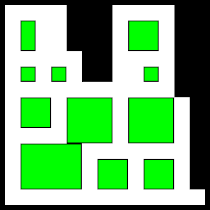

do rozwiązania:

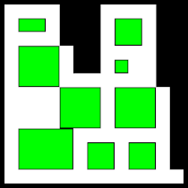

Po drodze istnieje wiele dużo gorszych rozwiązań, które algorytm by odrzucił. W rezultacie szansa na dotarcie do lepszego rozwiązania była bardzo mała.  

Okazuje się, że mutacja ma kluczowe znaczenie nawet na etapach szlifowania rozwiązania, dlatego wprowadziliśmy modyfikację, która ułatwiała przechodzenie pomiędzy takimi rozwiązaniami.  

### **Mechanizm silnej mutacji**

1. **Stagnacja**: Kiedy przez kilka pokoleń nie zmienia się najlepszy chromosom, uruchamiany jest mechanizm silnej mutacji.
2. **Tworzenie kopii**: Robimy `n` kopii najlepszego chromosomu, gdzie `n` rośnie wraz z długością stagnacji.
3. **Intensywna mutacja**: Kopie te są intensywnie mutowane.
4. **Wybór najlepszego**: Ze zmutowanych chromosomów wybierany jest najlepszy, który następnie dodawany jest do populacji.

Dzięki zastosowanemu elitaryzmu, jeżeli uzyskane rozwiązanie jest lepsze, mamy pewność, że nie przepadnie.  

W ten sposób zwiększamy szansę na uzyskiwanie jeszcze lepszych rozwiązań.

Wyniki algorytmów z dodatkowymi elementami zostały porównane z podstawową wersją. Pełny opis eksperymentów niżej w dokumencie.

&nbsp;  

## **5. Testy, obserwacje i wnioski**

### **Funkcja celu**

Pierwsze eksperymenty pozwoliły ustalić jakich współczynników będziemy używać w funkcji celu. Można powiedzieć, że jest to najważniejszy parametr ponieważ to on tak naprawdę definiuje jak będzie zachowywać się algorytm. Z racji, że porównanie wartości funkcji celu przy ustalaniu jej współczynników mija się z celem, bo naturalnym jest, że takie samo ułożenie towarów da inne wartości dla innych funkcji, porównywaliśmy właśnie zachowanie algorytmu oraz wysnuwaliśmy wnioski. Poprzez zachowanie algorytmu mamy na myśli, które rozwiązania są preferowane i jak algorytm układa towary.

```python
test_values = {
        'test1': [5, 7, 3, 2],
        'test2': [5, 7, 3, 3],
        'test3': [5, 7, 5, 3],
        'test4': [5, 10, 5, 3],
        'test5': [5, 7, 2, 2],
        'test6': [5, 10, 2, 2],
        'test7': [5, 7, 4, 2],
        'test8': [5, 10, 4, 2],
    }
```

W każdej tablicy jest kolejno `w1` `w2` `w3` `w4` gdzie:  
`w1` - nagroda za wstawione pole  
`w2` - kara za kolizję ze ścianą  
`w3` - kara za kolizję z innym towarem  
`w4` - kara za sąsiadowanie z towarem lub ścianą  

Logicznym jest żeby karać za kolizję ze ścianą bardziej niż nagradzać za wstawienie towaru żeby przypadkiem nie skończyć z rozwiązaniem niedopuszczalnym. Dodatkowo kara za sąsiadowanie jest dość mała ponieważ sąsiedztwo jest sumowane dla każdego pola, co znaczy, że może się dublować. Najlepsze rozmieszczenie uzsykał `test1` i `test7`. Algorytmy potrafiły osiągnąć zadowalające wyniki, zachowując poprawność przy wstawianiu towarów, które generowały kary np.  

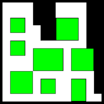
*test 1*

Parametr `w2` zdaje się nie wpływać na funkcję bardzo znacząco. Wystarczy, że jest większy od `w1` i rozwiązania z kolizją ze ścianą nie zachowają się w populacji na wysokich pozycjach. Trochę ciężej ustalić wpływ parametrów `w3` i `w4`. Z jednej strony nie mogą być zbyt małe, tak żeby generowane rozwiązania były poprawne, z drugiej zbyt duże kary uniemożliwią nawet chwilowe odejście od poprawności na rzecz eksploracji. Dobrze pokazuje to `test4`, który ma najwyższe wartości kar.

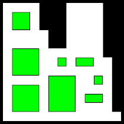
*test 4*

Pomijając fakt, że trafiliśmy dość słabo z początkowym rozmieszczeniem, bo wolna przestrzeń na górze zostałaby szybko zajęta gdyby któryś z niewidocznych towarów tam się znalazł (problem opisany w punkcie 4), to algorytm ustabilizował się po 14 epizodach i nie wygenerowane zostało już nic więcej. Jak widać algorytm gwarantuje, że uzyskamy rozwiązanie poprawne, natomiast mogłoby być znacznie lepsze.

Odwrotna sytuacja następuje gdy jak w przypadku `test5` kary będą małe

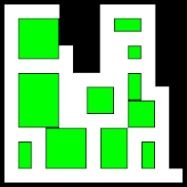
*test 5*

Co prawda generowane rozwiązanie jest poprawne, natomiast widać, że jest upakowane ciaśniej niż w przypadku `test1`

Podjęliśmy decyzję, że w dalszych testach użyjemy funkcji ze współczynnikami `[5, 7, 4, 2]`  

Jesteśmy świadomi, że mogło być to obarczone błędami poznawczymi i nasze wnioskowanie może być niepoprawne. Dodatkowo dużo zależało od losowego początkowego ustawienia i jest dość duże prawdopodobieństwo, że wpłynęło to na uzyskane wnioski. Weryfikację pozostawiliśmy dalszym testom. Zakładając, że funkcja celu została źle dobrana w dalszej części eksperymentów powinniśmy trafić na sytuacje, które by na to wskazywały. W momencie tworzenia tego dokumentu - czyli po przeprowadzeniu testów stwierdzamy jednak, że dobrane parametry dają sensowne wyniki.

&nbsp;  
&nbsp;  
&nbsp;  
&nbsp;  
&nbsp;  

### **Elitaryzm**

Wcześniejszy test został przeprowadzony z użyciem elitaryzmu o rozmiarze 1 - umożliwiało to porównanie zmian najlepszego rozwiązania zmniejszając chaotyczność wyników, natomiast warto określić czy jest potrzebny.

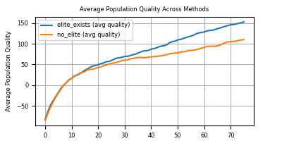
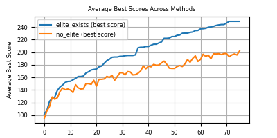

Tutaj wnioski są proste i przejrzyste - przez zachowanie osobnika elitarnego udaje się nie zatracić dobrych rozwiązań. Bez elitaryzmu algorytm co prawda nie traci zdolności do uzyskania dobrego rozwiązania, natomiast wyniki są zauważalnie gorsze.

&nbsp;  
&nbsp;  
&nbsp;  
&nbsp;  
&nbsp;  
&nbsp;  
&nbsp;  
&nbsp;  
&nbsp;  
&nbsp;  
&nbsp;  
&nbsp;  
&nbsp;  
&nbsp;  
&nbsp;  
&nbsp;  
&nbsp;  

### **Wybór krzyżowania i sukcesji**

Rozważaliśmy dwa rodzaje krzyżowania - jednopunktowe oraz dwupunktowe, a także dwa typy selekcji - turniejową i ruletkową.

Porównaliśmy każdy wariant poprzez 5-krotne wykonanie obliczeń na jednym zestawie danych, a następnie uśrednienie wyników.

Otrzymaliśmy poniższe wykresy

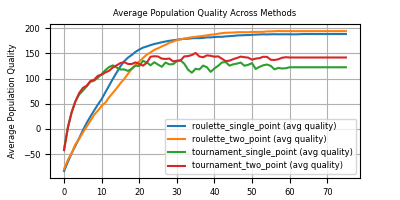
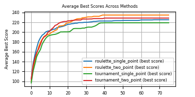

Z pierwszego wykresu można wywnioskować, że algorytmy używające selekcji ruletkowej poświecają więcej czasu eksploracja przestrzeni - punkty przegięcia krzywych są w okolicach 20 epizodu, za to przy selekcji turniejowej jeszcze przed
dziesiątym epizodem. Najlepsze średnie wyniki dał wariant używający selekcji ruletkowej i krzyżowania dwupunktowego.

Z racji, że chcemy żeby algorytm jak najdłużej eksplorował przestrzeń zdecydowaliśmy, to w fazie dalszych testów będziemy używać właśnie tej wersji algorytmu

### **Dobranie hiperparametrów**
Na kolejnym etapie testowania chcieliśmy ustalić wartości parametrów takich jak:

- Prawdopodobieństwo mutacji.
- Prawdopodobieństwa wyboru atrybutu mutowanego.
- Prawdopodobieństwo krzyżowania.

&nbsp;  
&nbsp;  
&nbsp;  

Stworzyliśmy listę potencjalnych parametrów wejściowych, aby możliwie dobrze pokryć najbardziej wpływające czynniki

```python
test_values = {
        'high_mutation_high_existance': [0.3, [0.4, 0.4, 0.2, 0.4], 0.4],
        'high_mutation_low_existance': [0.3, [0.4, 0.4, 0.2, 0.1], 0.4],
        'high_crossover': [0.1, [0.4, 0.4, 0.25, 0.15], 0.75],
        'high_crossover_high_mutation_high_existance': [0.3, [0.4, 0.4, 0.2, 0.4], 0.75],
        'high_crossover_high_mutation_low_existance': [0.3, [0.4, 0.4, 0.2, 0.1], 0.75],
    }
```

Parametry na liście są w kolejności wyliczenia ich kilka linii wyżej.
`existence` (ostatnia wartość z wewnętrznej listy) jest oznaczeniem tego jak często mutowanym parametrem będzie wartość wskazująca na to czy towar znajdzie się w magazynie. Duży współczynnik mutacji tego parametru powinien spowodować, że towary częściej będą wymieniane na inne, co może doprowadzać do tworzenia zupełnie innych rozwiązań. Jest to dość ważny parametr. Sposób testowania nie różnił się od tego z poprzedniego podpunktu.

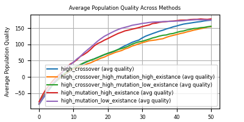
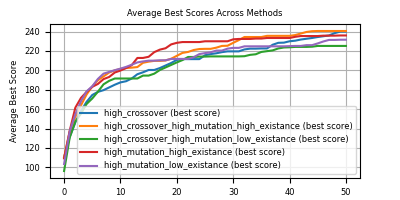

Można szybko zauważyć, że wysokie wartości wszystkich parametrów obniżają średnią jakość populacji. W naszym przypadku jest to bardzo korzystne, bo przy zachowaniu najlepszego osobnika dzięki elitaryzmowi możemy pozwolić na zwiększoną eksplorację przestrzeni. Potwierdza to też drugi wykres, na którym widać, że pomimo najgorszej średniej jakości, ten sam algorytm uzyskał najlepsze średnie wyniki.

&nbsp;  
&nbsp;  
&nbsp;  

### **Dodatkowe mechanizmy**

Tak jak zostało to wspomniane wcześniej, podczas znajdowania najlepszych rozwiązań napotykamy na dwa główne problemy: wielkość przestrzeni rozwiązań i utykanie na rozwiązaniach dobrych. Postanowiliśmy przeprowadzić dodatkowe testy, które pozwoliłby na ocenę przydatności zaproponowanych mechanizmów i ewentualne dołączenie ich do właściwego algorytmu.

```python
test_values = {
      'no_starting_population_no_mutating_best': (False, False),
      'no_starting_population_mutate_best': (False, True),
      'starting_population_no_mutating_best': (True, False),
  }
```

Uzyskaliśmy poniższe wykresy

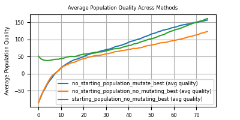
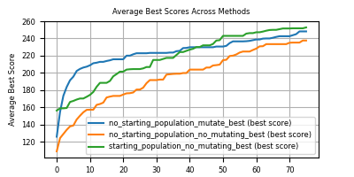

Każdy z mechanizmów wpływa pozytywnie na algorytm w pewien sposób. Dodanie dużej populacji początkowej końcowo prowadzi do lepszych wyników. Intensywne mutowanie najlepszego osobnika sprawia, że algorytm dość szybko uzyskuje dobre wyniki, natomiast nie przekłada się negatywnie na eksplorację - krzywa na pierwszym wykresie praktycznie pokrywa się z krzywą podstawowego algorytmu. Poprzez lekkie oddziaływanie na algorytm (dodawany jest tylko jeden osobnik), ostatecznie intensywna mutacja pozwala na osiąganie wyników lepszych w szybszym czasie. Oba mechanizmy zostały wykorzystane na etapie testów właściwych

&nbsp;  
&nbsp;  
&nbsp;  

### **Podsumowanie testów wstępnych**

Po analizie uzyskanych wyników udało się ustalić parametry algorytmu. Kilka wniosków:

- Po wizualnej ocenie wielu rozwiązań zaobserwowaliśmy, że wybrana funkcja celu daje wyniki bardzo dobre, a przede wszystkim prawidłowe (wszystkie wyniki znajdują się w katalogu `output` i `output/magazine_pictures`)
- Wybrane parametry kładą nacisk na przeszukanie jak największej przestrzeni - duże prawdopodobieństwa mutacji i krzyżowania, zastosowanie mechanizmu dużej populacji startowej, selekcja ruletkowa, krzyżowanie dwupunktowe - to zapewnia różnorodność genetyczną.
- Z drugiej strony przy tak dużej ruchliwości powinno dać się zapewnić, że algorytm poza błądzeniem w przestrzeni dotrze do jakiegoś rozwiązanie - do tego używamy
elitaryzmu i mechanizmu silnej mutacji

### **Testy na różnych zbiorach danych**

Przygotowany algorytm uruchomiliśmy na kilku różnych zbiorach danych (wykorzystany zbiór widoczny w akapicie trzecim)

Tutaj wyniki można analizować na wygenerowanych magazynach, ponieważ nasz problem polega na jak najlepszym rozmieszczeniu towarów.

Poniżej jak wygląda to już wizualnie:


*vertices1_wares1*

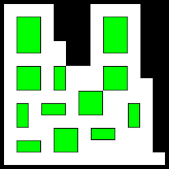
*vertices1_wares2*

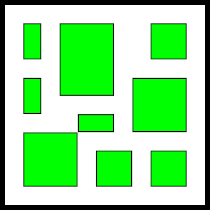
*vertices2_wares1*

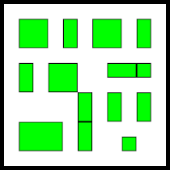
*vertices2_wares2*


*vertices3_wares1*


*vertices3_wares2*

&nbsp;  
&nbsp;  
&nbsp;  

W każdym przypadku towary rozmieszczone zostały rozmieszczone poprawnie. Algorytm znacznie częściej preferuje wstawienie do magazynu towarów większych. Często takie towary graniczą ze ścianą, bądź innym przedmiotem. Jest to naturalne ponieważ stosunek nagrody za coś takiego do kary jest dużo większy. Tam gdzie to możliwe towary są rozsuwane, a bardzo małe obiekty unikają styczności z resztą - przez to szansa na zatorowanie ścieżki jest bardzo mała.

## **6. Dodatkowe informacje**

Testy i generowanie wykresów są umieszczone w pliku `main.py`. Wszystkie rezultaty z wygenerowanymi wykresami są umieszczone w katalogu `output` w sposób intuicyjny.
